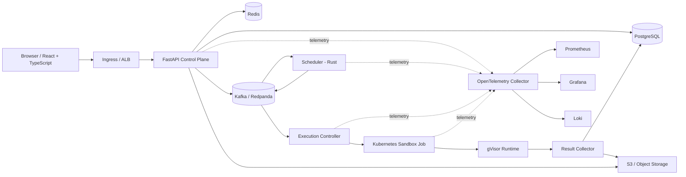

# ForgeRun — Distributed Code Execution & Judge Platform

## AI Build Reference / System Design Specification

**Document version:** 1.0
**Research date:** 2026-09-28
**Primary objective:** Build one portfolio project that demonstrates backend engineering, distributed systems, DSA, databases, caching, cloud, Kubernetes, security, testing, observability, CI/CD, reliability, and performance engineering.

> This document is the source of truth for implementation. The coding agent must not silently replace architectural decisions with easier or more generic alternatives. Any change that affects security boundaries, data consistency, execution semantics, or infrastructure must be recorded as an ADR before implementation.

---

# 1. Product Definition

## 1.1 What ForgeRun is

ForgeRun is a production-style online code execution and judging platform.

A user can:

1. Open a problem.
2. Write code in a supported language.
3. Submit the code.
4. Receive a durable submission ID immediately.
5. Watch the submission move through a distributed execution pipeline.
6. Receive compile/runtime/test results.
7. Inspect execution time and memory usage.
8. View historical submissions and verdicts.

The platform must execute untrusted code inside a strong sandbox boundary and must remain correct when services restart, messages are delivered more than once, pods disappear, or infrastructure temporarily becomes unavailable.

## 1.2 What makes it portfolio-grade

The project is not a CRUD application with Docker added to it. The visible engineering story is:

- event-driven architecture;
- durable state + asynchronous execution;
- custom priority/fairness scheduler;
- isolated code execution;
- Kubernetes orchestration;
- autoscaling based on workload;
- Redis-backed rate limiting and hot state;
- PostgreSQL transactional state and carefully designed indexes;
- AWS deployment with Terraform;
- CI/CD using GitHub Actions with short-lived cloud credentials;
- distributed tracing, metrics and logs;
- load tests and failure-injection experiments;
- security tests for hostile or pathological user programs.

## 1.3 Explicit non-goals for v1

Do not add these until the core system is stable:

- AI code generation;
- social features;
- chat;
- payment systems;
- microservice explosion;
- service mesh;
- multi-region active-active deployment;
- user-uploaded arbitrary Docker images;
- public internet access from submitted programs;
- dozens of programming languages.

The core system is the product.

---

# 2. High-Level Architecture



## 2.1 Core design principle

PostgreSQL is the durable source of truth for product state.

Kafka is the durable event backbone for asynchronous work and replay.

Redis is an optimization/control-plane store, not the authoritative database.

Kubernetes owns workload placement and lifecycle.

gVisor provides an additional execution-isolation layer for untrusted code. Kubernetes security controls, cgroups/resource limits, and network policy remain required; gVisor is not a complete security boundary by itself.

---

# 3. Service Boundaries

## 3.1 Web application

**Technology:** React + TypeScript + Vite.

Responsibilities:

- authentication screens;
- problem browsing;
- editor;
- submit/cancel;
- submission status;
- result details;
- personal submission history;
- public engineering/observability demo pages.

The frontend never talks directly to Kafka, Redis, Kubernetes, or PostgreSQL.

## 3.2 API / Control Plane

**Technology:** Python + FastAPI.

Responsibilities:

- authentication and authorization;
- problem metadata API;
- submission creation;
- submission cancellation;
- result queries;
- rate limiting integration;
- idempotency handling;
- transactional persistence;
- outbox creation;
- WebSocket/SSE status updates;
- OpenAPI contract.

The API must remain stateless. Multiple replicas must be interchangeable.

## 3.3 Scheduler

**Technology:** Rust.

This is the project’s custom distributed-systems/DSA showcase.

Responsibilities:

- consume submission-created events;
- partition work by Kafka partition/key;
- maintain per-partition priority/fairness queues;
- prevent one tenant from monopolizing execution capacity;
- apply aging to reduce starvation;
- enforce global/per-tenant concurrency quotas using Redis;
- assign an immutable attempt ID;
- emit scheduled execution events;
- expose scheduler metrics.

The scheduler must be replay-safe. It cannot assume a Kafka message is delivered only once.

## 3.4 Execution Controller

**Technology:** Rust or Python; default to Rust if the implementation team is comfortable with the Kubernetes client ecosystem.

Responsibilities:

- consume scheduled attempts;
- validate execution policy;
- create a short-lived Kubernetes Job;
- select the immutable language/runtime image;
- set resource limits;
- set securityContext;
- set the gVisor RuntimeClass;
- attach only the required service account;
- apply network policy labels;
- apply deadlines and cleanup policy;
- record the Kubernetes object identity;
- recover from controller restarts.

The controller must never execute user code itself.

## 3.5 Sandbox Job

Every execution attempt runs in a fresh, short-lived workload.

The Job contains the trusted ForgeRun runner and the submitted program. The runner:

1. validates the language/runtime;
2. writes source code into an isolated workspace;
3. compiles when required;
4. runs the compiled/interpreted program against test cases;
5. enforces per-test and total limits;
6. captures exit status, stdout/stderr with hard byte limits;
7. records peak memory/CPU/time where available;
8. writes a small machine-readable result artifact;
9. exits with a deterministic status.

The submission program itself does not have access to Kubernetes credentials, cloud credentials, Kafka credentials, database credentials, or the internal API.

## 3.6 Result Collector

Responsibilities:

- watch execution Jobs/Pods;
- detect terminal state;
- read runner result artifacts and bounded logs;
- map infrastructure outcomes to platform verdicts;
- update `submission_attempts` idempotently;
- emit `submission.completed`;
- delete/expire temporary resources;
- upload large logs/artifacts to object storage;
- emit execution metrics.

Result collection is at-least-once. Database finalization is idempotent.

---

# 4. Execution Lifecycle

## 4.1 Submission state machine

```text
CREATED
  |
  v
QUEUED
  |
  v
SCHEDULED
  |
  v
STARTING
  |
  +----> INFRASTRUCTURE_LOST ----> RETRYING ----+
  |                                               |
  v                                               |
COMPILING                                         |
  |                                               |
  +--> COMPILE_ERROR                              |
  |                                               |
  v                                               |
RUNNING                                           |
  |\                                              |
  | +--> TIME_LIMIT                               |
  | +--> MEMORY_LIMIT                             |
  | +--> RUNTIME_ERROR                            |
  | +--> OUTPUT_LIMIT                             |
  |                                               |
  v                                               |
JUDGING                                           |
  |                                               |
  +--> ACCEPTED                                   |
  +--> WRONG_ANSWER                               |
```

Terminal states:

- ACCEPTED
- WRONG_ANSWER
- COMPILE_ERROR
- RUNTIME_ERROR
- TIME_LIMIT
- MEMORY_LIMIT
- OUTPUT_LIMIT
- CANCELED
- SANDBOX_ERROR
- INFRASTRUCTURE_FAILURE

Only infrastructure failures are retryable by default.

Never retry user-code failures automatically.

## 4.2 Attempt model

A `submission` is the user action.

A `submission_attempt` is one infrastructure execution of that immutable submission.

This separation is critical. Re-execution, retries and rejudging must never mutate the original source-code submission record.

---

# 5. API Design

Base path:

`/api/v1`

## 5.1 Authentication

- `POST /auth/register`
- `POST /auth/login`
- `POST /auth/refresh`
- `POST /auth/logout`
- `GET /me`

Password storage must use a modern password hashing algorithm supported by the chosen security library; never store plaintext passwords.

JWT access tokens should be short-lived. Refresh-token rotation should be used if refresh tokens are implemented.

## 5.2 Problems

- `GET /problems`
- `GET /problems/{slug}`
- `POST /admin/problems`
- `POST /admin/problems/{id}/versions`

A problem version is immutable after publication.

## 5.3 Submissions

`POST /submissions`

Request:

```json
{
  "problem_id": "uuid",
  "language": "cpp",
  "source_code": "...",
  "client_request_id": "uuid"
}
```

Response:

```json
{
  "submission_id": "uuid",
  "attempt_id": "uuid",
  "status": "QUEUED",
  "created_at": "2026-09-28T12:00:00Z"
}
```

`GET /submissions/{id}`

`GET /submissions/{id}/attempts`

`POST /submissions/{id}/cancel`

## 5.4 Idempotency

The client provides `client_request_id`.

The server stores a unique `(user_id, client_request_id)` constraint.

A retry of the same HTTP request returns the existing submission instead of creating a second submission.

This protects against browser retries, mobile/network retries and client timeouts.

## 5.5 Status streaming

Prefer Server-Sent Events for v1 unless interactive bidirectional behavior is actually required.

`GET /submissions/{id}/events`

Events:

- queued
- scheduled
- starting
- compiling
- running
- judging
- completed
- failed

WebSocket support can be added later without changing the domain model.

---

# 6. Event Contracts

All events share:

```json
{
  "event_id": "uuid",
  "event_type": "submission.created",
  "schema_version": 1,
  "occurred_at": "2026-09-28T12:00:00Z",
  "correlation_id": "uuid",
  "causation_id": "uuid|null",
  "producer": "api-service",
  "payload": {}
}
```

## 6.1 Required events

### `submission.created`

```json
{
  "submission_id": "uuid",
  "attempt_id": "uuid",
  "user_id": "uuid",
  "problem_version_id": "uuid",
  "language": "cpp"
}
```

### `execution.scheduled`

```json
{
  "attempt_id": "uuid",
  "submission_id": "uuid",
  "priority": 50,
  "scheduled_at": "...",
  "scheduler_partition": 3
}
```

### `execution.started`

```json
{
  "attempt_id": "uuid",
  "pod_name": "forge-attempt-...",
  "node_name": "..."
}
```

### `execution.completed`

```json
{
  "attempt_id": "uuid",
  "verdict": "ACCEPTED",
  "execution_ms": 183,
  "cpu_ms": 160,
  "peak_memory_bytes": 73400320,
  "tests_passed": 10,
  "tests_total": 10,
  "artifact_uri": "s3://..."
}
```

### `execution.failed`

Must distinguish user-code failure from infrastructure failure.

---

# 7. Kafka Design

Kafka is the durable asynchronous backbone.

Recommended topics:

```text
forge.submission.created.v1
forge.execution.scheduled.v1
forge.execution.started.v1
forge.execution.completed.v1
forge.execution.failed.v1
forge.deadletter.v1
```

Partitioning:

- partition key: `user_id` for user-level ordering and stable load distribution;
- execution events may use `attempt_id` when per-attempt ordering matters.

Consumer groups:

- `scheduler`
- `execution-controller`
- `result-collector`
- `analytics`

Delivery model:

- assume at-least-once delivery;
- make consumers idempotent;
- never claim global end-to-end exactly-once semantics unless a complete transactional design is actually implemented.

Kafka documentation explicitly notes that exactly-once behavior across an external destination generally requires coordination with that destination; default application designs commonly rely on at-least-once delivery plus idempotent processing.

Reference: https://kafka.apache.org/41/design/design/

---

# 8. Database Design

PostgreSQL is the authoritative state store.

## 8.1 Main tables

### `users`

- `id UUID PK`
- `email CITEXT UNIQUE`
- `password_hash TEXT`
- `role TEXT`
- `created_at TIMESTAMPTZ`

### `problems`

- `id UUID PK`
- `slug TEXT UNIQUE`
- `title TEXT`
- `difficulty TEXT`
- `status TEXT`
- `created_at`

### `problem_versions`

- `id UUID PK`
- `problem_id UUID FK`
- `version INTEGER`
- `runtime_manifest JSONB`
- `published_at`
- unique `(problem_id, version)`

### `submissions`

- `id UUID PK`
- `user_id UUID FK`
- `problem_version_id UUID FK`
- `language TEXT`
- `source_code TEXT`
- `source_sha256 TEXT`
- `client_request_id UUID`
- `created_at`
- unique `(user_id, client_request_id)`

### `submission_attempts`

- `id UUID PK`
- `submission_id UUID FK`
- `attempt_no INTEGER`
- `status TEXT`
- `verdict TEXT`
- `scheduled_at`
- `started_at`
- `finished_at`
- `execution_ms BIGINT`
- `cpu_ms BIGINT`
- `peak_memory_bytes BIGINT`
- `pod_name TEXT`
- `retry_count INTEGER`
- unique `(submission_id, attempt_no)`

### `test_results`

- `id UUID PK`
- `attempt_id UUID FK`
- `test_index INTEGER`
- `verdict TEXT`
- `execution_ms BIGINT`
- `memory_bytes BIGINT`
- `stdout_excerpt TEXT`
- `stderr_excerpt TEXT`
- unique `(attempt_id, test_index)`

### `outbox_events`

- `id UUID PK`
- `aggregate_type TEXT`
- `aggregate_id UUID`
- `event_type TEXT`
- `payload JSONB`
- `created_at`
- `published_at NULLABLE`
- index on `(published_at, created_at)`

### `idempotency_keys`

- `id UUID PK`
- `user_id UUID`
- `key TEXT`
- `response_hash TEXT`
- `resource_id UUID`
- `created_at`
- unique `(user_id, key)`

## 8.2 Transaction boundaries

Creating a submission must happen in one database transaction:

1. validate request;
2. insert submission;
3. insert first attempt;
4. insert outbox event;
5. commit.

A separate outbox publisher reads committed rows and publishes Kafka events.

This avoids the classic failure mode where the database commit succeeds but message publication fails.

## 8.3 Database indexing

At minimum:

- `users(email)` unique;
- `problems(slug)` unique;
- `submissions(user_id, created_at DESC)`;
- `submission_attempts(submission_id, attempt_no)` unique;
- `submission_attempts(status, scheduled_at)`;
- `test_results(attempt_id, test_index)` unique;
- `outbox_events(published_at, created_at)` partial index for unpublished rows.

Do not add indexes without measuring their benefit. Indexes improve lookup performance but add write/storage overhead.

Use `EXPLAIN ANALYZE` for performance investigations.

References:
- https://www.postgresql.org/docs/current/indexes.html
- https://www.postgresql.org/docs/18/using-explain.html
- https://www.postgresql.org/docs/current/mvcc.html

---

# 9. Redis Design

Redis must never be the canonical source of submission status.

Use it for:

1. distributed rate limiting;
2. ephemeral concurrency counters;
3. scheduler hot metadata;
4. short-lived cache of problem metadata;
5. optional live-status fanout.

Recommended keys:

```text
rate:user:{user_id}
rate:ip:{ip_hash}
quota:user:{user_id}
cache:problem:{problem_id}:{version}
active:user:{user_id}
```

Rate limiting:

Implement token bucket or sliding-window logic with atomic Lua where needed.

Do not rely on local-process counters because multiple API replicas must enforce the same limit.

Reference: https://redis.io/docs/latest/develop/use-cases/rate-limiter/

Redis Streams may be used for a later notification/fanout feature, but Kafka remains the primary durable event backbone in this design.

Reference: https://redis.io/docs/latest/develop/data-types/streams/

---

# 10. Scheduler Design

This is the project’s algorithmic showcase.

## 10.1 Scheduling goals

- low queue latency;
- starvation resistance;
- per-user fairness;
- bounded concurrency;
- retry safety;
- predictable ordering within a partition;
- high throughput;
- deterministic tests.

## 10.2 Queue model

Within each Kafka partition:

```text
Partition
  |
  +-- Tenant A queue
  +-- Tenant B queue
  +-- Tenant C queue
  |
  +-- weighted fair selection
  |
  +-- aging adjustment
  |
  +-- global concurrency check
  |
  +-- emit scheduled event
```

Use a heap-backed priority structure for selecting the next eligible queue.

Target complexity:

- enqueue: O(log N)
- dequeue: O(log N)
- tenant lookup: O(1) average using a hash map

## 10.3 Effective priority

Conceptual formula:

```text
effective_priority = base_priority + aging_bonus
aging_bonus = min(MAX_AGING_BONUS, floor(wait_seconds / AGING_INTERVAL))
```

Tie-break using creation timestamp and a deterministic monotonic sequence.

This must be implemented in a way that does not require recalculating every queued item every second. Prefer lazy priority refresh when items become candidates.

## 10.4 Fairness

A high-priority user must not be able to create unlimited work and starve everyone else.

Enforce:

- per-user pending limit;
- per-user running limit;
- global running limit;
- optional organization quota;
- admission rejection with HTTP 429 when limits are exceeded.

## 10.5 Scheduler crash behavior

The scheduler may crash after publishing but before committing its Kafka offset.

The same submission can then be scheduled twice.

Therefore:

- `attempt_id` is immutable;
- execution controller performs idempotent reconciliation;
- Kubernetes Job name is derived deterministically from `attempt_id`;
- duplicate `execution.scheduled` events resolve to the same Job rather than creating multiple Jobs.

---

# 11. Execution Sandbox Security

This is the most security-sensitive component.

## 11.1 Threat model

Assume submitted programs may attempt:

- infinite CPU usage;
- excessive memory allocation;
- process explosion;
- filesystem exhaustion;
- huge stdout/stderr output;
- network access;
- reading environment variables;
- scanning internal IPs;
- accessing the node filesystem;
- privilege escalation;
- ptrace/debugging other processes;
- reading Kubernetes service-account tokens;
- abusing setuid binaries;
- exploiting runtime/kernel/container bugs.

The platform must assume the code is hostile, not merely buggy.

## 11.2 Required isolation layers

Use defense in depth:

1. dedicated runner namespace;
2. dedicated runner node group for the strongest production demonstration;
3. gVisor RuntimeClass;
4. Kubernetes Restricted Pod Security posture where compatible;
5. non-root user for submitted programs;
6. `allowPrivilegeEscalation: false`;
7. drop all Linux capabilities unless an explicitly documented runtime requirement exists;
8. `readOnlyRootFilesystem: true` where possible;
9. `automountServiceAccountToken: false`;
10. `hostNetwork: false`;
11. `hostPID: false`;
12. `hostIPC: false`;
13. no `hostPath` volumes;
14. network policy denying all egress from sandbox Pods;
15. resource requests and hard limits;
16. process-count limits;
17. ephemeral-storage limits;
18. stdout/stderr byte limits;
19. execution timeout;
20. Kubernetes Job deadline;
21. immutable runtime images;
22. image signature/scan checks before deployment;
23. no cloud credentials in sandbox Pods.

Kubernetes Pod Security Standards define a Restricted profile aimed at strong hardening. Kubernetes NetworkPolicy supports ingress/egress restrictions when the cluster networking provider enforces them. gVisor adds a user-space kernel/sandbox boundary for untrusted workloads, but its own documentation stresses that host resource controls and network policy are still part of the defense.

References:
- https://kubernetes.io/docs/concepts/security/pod-security-standards/
- https://kubernetes.io/docs/concepts/services-networking/network-policies/
- https://gvisor.dev/docs/architecture_guide/intro/
- https://gvisor.dev/docs/architecture_guide/security/
- https://docs.docker.com/engine/security/

## 11.3 Sandbox filesystem

The submission receives:

```text
/workspace
    source files
    compiled binary
    runner metadata
```

Use an ephemeral filesystem. Do not mount host directories.

The runner's hidden tests must never be exposed as ordinary user-readable files.

Preferred design:

- trusted runner process owns the hidden test data;
- user process receives each test through stdin or a controlled pipe;
- user process cannot inspect runner-private test storage;
- stdout/stderr are captured by the runner;
- result is written to a small controlled artifact.

## 11.4 Network

Default sandbox policy:

```text
Ingress: deny
Egress: deny
DNS: deny
```

No external packages may be downloaded during submission execution.

Languages and dependencies are pre-baked into immutable runtime images.

---

# 12. Runtime Images

Do not use one gigantic image containing every compiler.

Create separate immutable images by runtime family:

```text
forge-runner/python
forge-runner/cpp
forge-runner/java
forge-runner/rust
```

Each image contains:

- language runtime/compiler;
- minimal required standard tooling;
- ForgeRun trusted runner;
- no package managers needed at runtime;
- no SSH;
- no shell utilities beyond what is required.

Tag images with immutable Git commit + digest.

Never use `latest` in Kubernetes production manifests.

---

# 13. Kubernetes Design

Namespaces:

```text
forge-system
forge-control
forge-runner
forge-observability
forge-data
```

The sandbox workload runs only in `forge-runner`.

## 13.1 Control-plane workloads

Deployments:

- api
- scheduler
- execution-controller
- result-collector
- outbox-publisher

Each Deployment must have:

- resource requests/limits;
- liveness/readiness/startup probes where meaningful;
- PodDisruptionBudget for replicated services where useful;
- anti-affinity or topology spread for critical replicas;
- graceful termination handling;
- least-privilege ServiceAccount/RBAC.

## 13.2 Sandbox workload

Each execution attempt is a short-lived Job.

Required fields include:

```yaml
restartPolicy: Never
activeDeadlineSeconds: <policy-derived>
automountServiceAccountToken: false
securityContext:
  runAsNonRoot: true
  seccompProfile:
    type: RuntimeDefault
```

The runtime class should point at gVisor in production environments where supported.

## 13.3 Resource policy

Each language/problem version defines:

- CPU request;
- CPU limit;
- memory request;
- memory limit;
- ephemeral storage limit;
- max process count;
- wall-clock deadline;
- maximum output bytes.

Kubernetes schedules based on resource requests and enforces memory limits at the container boundary. Avoid leaving execution Pods without limits.

Reference: https://kubernetes.io/docs/tasks/configure-pod-container/assign-memory-resource/

## 13.4 Autoscaling

Use two levels:

1. **Pod/workload autoscaling** — HPA/KEDA for control-plane services.
2. **Node autoscaling** — EKS Managed Node Groups plus an appropriate node-scaling mechanism.

KEDA can use Kafka lag/event metrics to activate or scale consumer workloads.

References:
- https://keda.sh/docs/latest/scalers/
- https://keda.sh/docs/2.21/concepts/scaling-deployments/
- https://kubernetes.io/docs/tasks/run-application/horizontal-pod-autoscale-walkthrough/

For the first cloud version, keep the autoscaling model understandable. Do not combine KEDA, HPA custom metrics, Cluster Autoscaler and Karpenter without a reason.

---

# 14. AWS Production Architecture

Recommended AWS target:

```text
Internet
   |
Route 53
   |
ALB / Ingress
   |
EKS
 |        \
API       Control/Scheduler
 |
 +--> RDS PostgreSQL
 +--> ElastiCache Redis
 +--> MSK/Redpanda-managed Kafka OR self-hosted Kafka for lower-cost demo
 +--> S3
```

For a portfolio project, choose managed services selectively. The point is to demonstrate engineering judgment, not to self-host every database.

## 14.1 EKS

Use EKS with separate node groups for:

- system/control workloads;
- runner workloads.

Runner nodes should be tainted so ordinary application Pods are not scheduled there accidentally.

Taints/tolerations are useful here because taints repel Pods that do not explicitly tolerate the node.

Reference: https://kubernetes.io/docs/concepts/scheduling-eviction/taint-and-toleration/

## 14.2 Database

Production target:

- Amazon RDS PostgreSQL.

Local development:

- PostgreSQL Docker container.

Do not use the local container schema as an excuse to skip migrations.

Use Alembic for migrations.

## 14.3 Redis

Local:

- Redis container.

Cloud:

- ElastiCache Redis/Valkey-compatible service as appropriate at implementation time.

## 14.4 Object storage

Use S3 for:

- large execution logs;
- benchmark reports;
- optional source archives if later required;
- build artifacts that do not belong in Git.

Never store the primary submission metadata only in S3.

## 14.5 IAM

Use least-privilege IAM.

Control-plane Pods needing AWS services should use Kubernetes service identities / EKS Pod Identity rather than embedding long-lived AWS credentials.

Reference: https://docs.aws.amazon.com/eks/latest/userguide/pod-identities.html

---

# 15. Infrastructure as Code

Use Terraform.

Directory:

```text
infra/terraform/
  modules/
    network/
    eks/
    rds/
    redis/
    s3/
    iam/
  environments/
    dev/
    staging/
    prod/
```

Terraform rules:

- remote state;
- state locking where supported;
- no secrets committed to the repository;
- modules for reusable infrastructure;
- separate environment variables;
- `terraform fmt` in CI;
- `terraform validate` in CI;
- plan on pull request;
- apply only from protected deployment workflow.

Reference: https://developer.hashicorp.com/terraform/language

---

# 16. CI/CD

GitHub Actions pipeline:

```text
Pull Request
  |
  +--> lint
  +--> unit tests
  +--> integration tests
  +--> frontend build
  +--> backend build
  +--> Rust tests
  +--> container build
  +--> vulnerability scan
  +--> IaC validation

main
  |
  +--> build immutable images
  +--> push to registry
  +--> sign images
  +--> deploy staging
  +--> smoke tests
  +--> production approval
  +--> deploy production
```

Use:

- GitHub Actions environments;
- protected production environment;
- concurrency to prevent overlapping production deploys;
- OIDC to AWS instead of long-lived AWS access keys;
- minimum workflow permissions;
- third-party Actions pinned to full commit SHAs where practical.

References:
- https://docs.github.com/en/actions/how-tos/deploy/configure-and-manage-deployments/control-deployments
- https://docs.github.com/en/actions/how-tos/secure-your-work/security-harden-deployments/oidc-in-aws
- https://docs.github.com/en/actions/reference/security/secure-use

Optional supply-chain enhancement:

- image SBOM;
- dependency vulnerability scan;
- Cosign image signing/verification.

Reference: https://docs.sigstore.dev/cosign/signing/signing_with_containers/

---

# 17. Observability

Use OpenTelemetry as the instrumentation layer.

OpenTelemetry supports telemetry collection for traces, metrics and logs.

Reference: https://opentelemetry.io/docs/

## 17.1 Trace propagation

Every submission receives:

- `correlation_id`;
- `trace_id`;
- `submission_id`;
- `attempt_id`.

Trace:

```text
HTTP POST /submissions
   |
   +-- PostgreSQL transaction
   |
   +-- Outbox publish
   |
   +-- Kafka consume
   |
   +-- Scheduler
   |
   +-- Execution Controller
   |
   +-- Kubernetes Job
   |
   +-- Result Collector
   |
   +-- PostgreSQL finalization
```

## 17.2 Metrics

HTTP:

- request count;
- error count;
- request duration histogram;
- active requests.

Queue:

- Kafka consumer lag;
- queued submissions;
- scheduling latency;
- scheduler decisions/sec;
- fairness metrics.

Execution:

- submissions/sec;
- attempts/sec;
- compile failures;
- accepted/wrong-answer ratio;
- p50/p95/p99 execution latency;
- sandbox startup latency;
- retry count;
- sandbox failures;
- timeout count;
- memory-limit count.

Infrastructure:

- CPU utilization;
- memory utilization;
- Pod pending time;
- node saturation;
- PostgreSQL connection pool utilization;
- Redis latency;
- Kafka lag.

Prometheus metric types should be chosen deliberately. Counters are suitable for monotonically increasing counts, while histograms are useful for latency distributions.

Reference: https://prometheus.io/docs/concepts/metric_types/

## 17.3 Grafana dashboards

Create separate dashboards:

1. API / Control Plane
2. Scheduler
3. Execution Fleet
4. Kafka
5. PostgreSQL / Redis
6. Security / Sandbox
7. Load Test

The portfolio demo must show the system under load, not only static architecture diagrams.

---

# 18. Reliability and Failure Handling

## 18.1 Required failure cases

Test each deliberately:

1. API Pod killed.
2. Scheduler Pod killed.
3. Execution Controller killed.
4. Result Collector killed.
5. Kafka consumer restarted.
6. PostgreSQL connection interrupted.
7. Redis unavailable.
8. Sandbox Pod killed mid-execution.
9. Runner node drained.
10. Execution times out.
11. User program forks repeatedly.
12. User program allocates excessive memory.
13. User program writes excessive output.
14. User program attempts network access.
15. Duplicate Kafka event delivered.
16. HTTP submission request retried.

## 18.2 Correctness properties

After recovery:

- accepted submissions are not silently lost;
- a duplicate event does not create duplicate logical attempts;
- terminal attempt state does not revert to a non-terminal state;
- retries increment `retry_count`;
- infrastructure failures are distinguishable from code failures;
- no execution remains indefinitely in `RUNNING`.

## 18.3 Timeouts

Enforce timeouts at multiple layers:

- API request timeout;
- Kafka consumer processing timeout/retry policy;
- scheduler lease/heartbeat timeout;
- Kubernetes Job deadline;
- language runner wall-clock timeout;
- result collector stale-attempt reconciliation.

Multiple layers are deliberate: one timeout should not be trusted as the only termination mechanism.

---

# 19. Security Testing

Create a dedicated `security-tests` directory.

Benign pathological programs should include:

- infinite loop;
- large memory allocation;
- recursive process creation;
- very large stdout;
- large temporary-file creation;
- attempted TCP connection to a blocked address;
- attempted DNS resolution;
- attempted access to `/proc` sensitive paths;
- attempted environment-variable enumeration;
- attempted access to `/var/run/secrets`;
- attempt to create privileged sockets;
- attempt to access host-mounted paths (which should not exist).

Do not include real host/container breakout exploits in the repository. The goal is to verify policy enforcement, not publish an exploitation kit.

Every security test should produce an explicit expected result.

Example:

```text
TEST: network_access_denied
INPUT: connect to 1.1.1.1:443
EXPECTED: connection fails / timeout
EXPECTED_VERDICT: RUNTIME_ERROR or POLICY_VIOLATION
```

---

# 20. Testing Strategy

## 20.1 Unit tests

Backend:

- validation;
- authentication;
- domain state transitions;
- idempotency.

Scheduler:

- heap behavior;
- fairness;
- aging;
- quota handling;
- duplicate events;
- starvation tests;
- deterministic ordering.

Runner:

- language adapters;
- verdict mapping;
- output truncation;
- timeout behavior;
- resource policy parsing.

## 20.2 Integration tests

Use ephemeral infrastructure with Docker Compose or test containers.

Required paths:

```text
POST submission
 -> PostgreSQL
 -> outbox
 -> Kafka
 -> scheduler
 -> execution controller
 -> fake execution adapter
 -> result collector
 -> PostgreSQL
```

## 20.3 End-to-end tests

Run against a local Kubernetes cluster such as kind or k3d.

Test:

- real Kafka;
- real PostgreSQL;
- real Redis;
- real Kubernetes Job;
- real sandbox configuration where locally supported.

## 20.4 Load tests

Use k6.

Scenarios:

1. 100 concurrent users submitting normally.
2. Burst of 1,000 submissions.
3. Mixed language submissions.
4. Large queue with slow programs.
5. High duplicate-request rate.
6. Scheduler restart during load.
7. Worker-node termination during load.

Never place invented performance numbers in README/resume. Record actual test results with hardware and cluster configuration.

---

# 21. Benchmarking

## 21.1 Scheduler benchmark

Use Rust Criterion.

Measure:

- enqueue throughput;
- dequeue throughput;
- heap size scaling;
- fairness overhead;
- duplicate suppression;
- memory usage.

## 21.2 API benchmark

Measure:

- p50/p95/p99 latency;
- requests/sec;
- DB connection utilization.

## 21.3 End-to-end benchmark

Measure:

```text
submission received
     -> queued
     -> scheduled
     -> sandbox started
     -> completed
```

Break total latency into components.

Do not hide queue latency inside execution latency.

---

# 22. Repository Layout

```text
forgerun/
├── apps/
│   └── web/
├── services/
│   ├── api/
│   ├── scheduler/
│   ├── execution-controller/
│   ├── result-collector/
│   └── outbox-publisher/
├── runner/
│   ├── core/
│   ├── adapters/
│   └── images/
│       ├── python/
│       ├── cpp/
│       ├── java/
│       └── rust/
├── packages/
│   └── contracts/
├── problems/
│   ├── catalog/
│   └── test-data/
├── tests/
│   ├── integration/
│   ├── e2e/
│   ├── load/
│   ├── security/
│   └── chaos/
├── deploy/
│   ├── helm/
│   ├── policies/
│   └── runtimeclasses/
├── infra/
│   └── terraform/
├── observability/
│   ├── dashboards/
│   ├── alerts/
│   └── otel/
├── docs/
│   ├── adr/
│   ├── architecture/
│   ├── runbooks/
│   └── threat-model/
├── .github/
│   └── workflows/
└── README.md
```

---

# 23. ADRs Required

Create these before or during implementation:

- ADR-001: Why event-driven architecture?
- ADR-002: Why Kafka instead of Redis as the primary event backbone?
- ADR-003: Why per-attempt Kubernetes Jobs?
- ADR-004: Why gVisor?
- ADR-005: Why PostgreSQL as source of truth?
- ADR-006: At-least-once events + idempotent consumers.
- ADR-007: Scheduler fairness algorithm.
- ADR-008: Why separate runner node group?
- ADR-009: Why managed AWS services vs self-hosting.
- ADR-010: Why SSE instead of WebSockets for v1.

Every ADR contains:

```text
Context
Decision
Alternatives considered
Consequences
Security impact
Operational impact
```

---

# 24. Local Development Environment

The entire system must work locally without AWS.

Minimum local stack:

```text
Docker Compose
  PostgreSQL
  Redis
  Kafka/Redpanda
  OTEL Collector
  Prometheus
  Grafana
  Loki
```

Kubernetes development:

```text
kind or k3d
  API
  Scheduler
  Controller
  Result Collector
  Sandbox Jobs
```

Local startup target:

```text
make bootstrap
make dev
make test
make e2e
make load
make down
```

A new developer should not need to manually create database tables or Kafka topics.

---

# 25. Configuration Rules

Configuration comes from environment variables or mounted configuration, never hard-coded secrets.

Example:

```text
DATABASE_URL
REDIS_URL
KAFKA_BROKERS
S3_BUCKET
AWS_REGION
JWT_ISSUER
JWT_AUDIENCE
SANDBOX_RUNTIME_CLASS
MAX_CONCURRENT_ATTEMPTS
DEFAULT_TIME_LIMIT_MS
DEFAULT_MEMORY_LIMIT_MB
MAX_OUTPUT_BYTES
```

Use typed configuration objects and validate configuration at process start.

Fail fast when mandatory configuration is missing.

---

# 26. Logging Rules

All services emit structured JSON logs.

Required fields:

```json
{
  "timestamp": "...",
  "level": "INFO",
  "service": "scheduler",
  "trace_id": "...",
  "correlation_id": "...",
  "submission_id": "...",
  "attempt_id": "...",
  "event": "attempt_scheduled"
}
```

Never log:

- passwords;
- JWTs;
- AWS credentials;
- database credentials;
- full source code;
- hidden test data.

---

# 27. Error Taxonomy

Use a stable error model.

```text
AUTH_*
VALIDATION_*
RATE_LIMIT_*
NOT_FOUND_*
CONFLICT_*
DEPENDENCY_*
EXECUTION_*
SANDBOX_*
INFRA_*
INTERNAL_*
```

HTTP mapping:

- 400 invalid request;
- 401 unauthenticated;
- 403 unauthorized;
- 404 resource not found;
- 409 idempotency/resource conflict;
- 422 semantic validation failure;
- 429 rate limited;
- 500 unexpected server error;
- 503 temporary dependency/unavailable service.

Do not expose stack traces to end users.

---

# 28. Data Retention

Default retention policy:

- submission metadata: long-lived;
- source code: configurable retention;
- detailed execution logs: short retention in PostgreSQL, long retention in S3 only if required;
- temporary artifacts: automatically deleted;
- failed sandbox resources: aggressively cleaned;
- telemetry: shorter than product data.

Retention must be configurable.

---

# 29. Demo Experience

The portfolio website should open with a live architecture view.

Recommended demo flow:

### Demo 1 — Normal submission

Submit a C++ solution and show:

```text
Created -> Queued -> Scheduled -> Running -> Accepted
```

Then open the trace.

### Demo 2 — Failure recovery

Submit a long-running job, kill its execution Pod, and show:

```text
Running -> Infrastructure Failure -> Retry -> Accepted
```

### Demo 3 — Backpressure

Generate a burst of submissions and show:

- Kafka lag;
- queue depth;
- scheduler behavior;
- HPA/KEDA scaling;
- p95 latency.

### Demo 4 — Security

Submit an infinite loop / memory bomb / network probe and show the job being terminated by policy.

### Demo 5 — Worker/node failure

Drain or terminate a runner node and show Kubernetes rescheduling/recovery.

These demonstrations are the project's strongest proof of engineering depth.

---

# 30. README Structure

The README should not begin with a wall of generic marketing copy.

Recommended order:

1. One-sentence problem statement.
2. Architecture diagram.
3. Live demo.
4. 60-second failure-recovery video/GIF.
5. Key engineering decisions.
6. Security model.
7. Scheduler design.
8. Observability screenshots.
9. Benchmark results.
10. Local setup.
11. Cloud deployment.
12. ADR index.
13. Test strategy.
14. Trade-offs/limitations.

The README should explicitly state where measurements came from.

---

# 31. Build Phases

## Phase 0 — Foundations

Deliver:

- monorepo;
- code quality tooling;
- shared event schema;
- PostgreSQL migrations;
- local Docker Compose;
- CI skeleton;
- ADR directory.

Exit criteria:

- `make bootstrap` works;
- tests run in CI;
- migrations run from zero.

## Phase 1 — Vertical Slice

Build:

```text
React
 -> API
 -> PostgreSQL
 -> outbox
 -> Kafka
 -> scheduler
 -> execution controller
 -> one Python sandbox
 -> result collector
 -> result UI
```

Only support Python initially.

This phase proves the architecture.

## Phase 2 — Scheduler Depth

Add:

- Rust scheduler;
- priority queues;
- fairness;
- aging;
- quotas;
- idempotent dispatch;
- scheduler benchmarks.

## Phase 3 — Execution Platform

Add:

- C++;
- Java;
- Rust;
- runtime policy manifests;
- compile/run limits;
- output limits;
- per-test results.

## Phase 4 — Security Hardening

Add:

- gVisor;
- Restricted pod hardening;
- NetworkPolicies;
- dedicated runner nodes;
- taints/tolerations;
- security test suite.

## Phase 5 — Observability

Add:

- OpenTelemetry;
- Prometheus;
- Grafana;
- Loki;
- trace propagation;
- alerts;
- runbooks.

## Phase 6 — Cloud

Add:

- AWS VPC;
- EKS;
- RDS;
- Redis/Valkey service;
- S3;
- ECR;
- IAM/OIDC;
- Terraform.

## Phase 7 — Reliability

Add:

- failure injection;
- retries;
- reconciliation loops;
- stale-attempt reaper;
- node-loss scenarios;
- duplicate-event tests.

## Phase 8 — Benchmark + Portfolio

Add:

- k6 load tests;
- Criterion scheduler benchmarks;
- benchmark report;
- polished dashboards;
- architecture document;
- ADRs;
- demo video;
- resume bullets based only on measured results.

---

# 32. Definition of Done

The project is NOT done when the UI works.

It is done only when all are true:

- a submission can be accepted end-to-end;
- duplicate HTTP requests are idempotent;
- duplicate Kafka events are safe;
- scheduler restarts recover queued work;
- execution Pod failures are detected and handled;
- user programs cannot access the internal network by default;
- runner Pods do not receive service-account tokens;
- resource limits terminate pathological programs;
- database migrations are reproducible;
- integration tests pass from a clean environment;
- load test is repeatable;
- telemetry spans the submission lifecycle;
- cloud infrastructure is reproducible via Terraform;
- CI/CD deploys the system;
- a failure demo works live;
- every claimed performance number has a reproducible benchmark.

---

# 33. Important Engineering Trade-offs

## Why not microservices for everything?

Because service boundaries should follow independent scaling/failure/ownership boundaries. Splitting every domain into its own service creates operational noise without proving engineering depth.

## Why Kafka if the project is one application?

Because the execution plane is asynchronous, can burst, needs replay/fault tolerance, and benefits from consumer-group scaling.

## Why not Redis Streams instead of Kafka?

Redis Streams can provide consumer groups and at-least-once processing, but Kafka is the stronger primary event-backbone choice for this portfolio because partitioning, durable log semantics and replay are central to the design. Redis remains useful for fast control-plane state and rate limiting.

## Why Kubernetes Jobs instead of an always-running executor pool?

Per-attempt Jobs give a clean workload lifecycle and a strong declarative reconciliation model. The trade-off is higher control-plane overhead. This is acceptable for v1 and is itself an engineering topic worth measuring.

## Why gVisor?

Because arbitrary submitted code is a materially different threat model from ordinary trusted application containers. gVisor adds a user-space kernel isolation layer; it does not remove the need for resource controls and network restrictions.

## Why PostgreSQL + Redis?

PostgreSQL gives durable transactional state. Redis provides low-latency ephemeral state and centralized rate limiting. Their roles are intentionally different.

---

# 34. Research References

Primary technical references used to shape this specification:

### Kubernetes
- Jobs: https://kubernetes.io/docs/concepts/workloads/controllers/job/
- Pod lifecycle: https://kubernetes.io/docs/concepts/workloads/pods/pod-lifecycle/
- Pod Security Standards: https://kubernetes.io/docs/concepts/security/pod-security-standards/
- NetworkPolicy: https://kubernetes.io/docs/concepts/services-networking/network-policies/
- Taints/Tolerations: https://kubernetes.io/docs/concepts/scheduling-eviction/taint-and-toleration/
- HPA: https://kubernetes.io/docs/tasks/run-application/horizontal-pod-autoscale-walkthrough/
- Resource limits: https://kubernetes.io/docs/tasks/configure-pod-container/assign-memory-resource/

### gVisor / Container isolation
- Security introduction: https://gvisor.dev/docs/architecture_guide/intro/
- Security model: https://gvisor.dev/docs/architecture_guide/security/
- Docker security: https://docs.docker.com/engine/security/

### Kafka
- Design and delivery semantics: https://kafka.apache.org/41/design/design/

### Redis
- Rate limiting: https://redis.io/docs/latest/develop/use-cases/rate-limiter/
- Streams: https://redis.io/docs/latest/develop/data-types/streams/

### PostgreSQL
- Indexes: https://www.postgresql.org/docs/current/indexes.html
- Transactions/MVCC: https://www.postgresql.org/docs/current/mvcc.html
- EXPLAIN: https://www.postgresql.org/docs/18/using-explain.html

### Observability
- OpenTelemetry: https://opentelemetry.io/docs/
- Prometheus metric types: https://prometheus.io/docs/concepts/metric_types/
- Grafana alerting guidance: https://grafana.com/docs/grafana/latest/alerting/guides/

### Infrastructure / CI
- Terraform language: https://developer.hashicorp.com/terraform/language
- GitHub Actions deployments: https://docs.github.com/en/actions/how-tos/deploy/configure-and-manage-deployments/control-deployments
- GitHub Actions OIDC with AWS: https://docs.github.com/en/actions/how-tos/secure-your-work/security-harden-deployments/oidc-in-aws
- GitHub Actions secure use: https://docs.github.com/en/actions/reference/security/secure-use
- Sigstore/Cosign: https://docs.sigstore.dev/cosign/signing/signing_with_containers/

### AWS / EKS
- EKS security: https://docs.aws.amazon.com/eks/latest/best-practices/security.html
- EKS networking: https://docs.aws.amazon.com/eks/latest/best-practices/network-security.html
- EKS Pod Identity: https://docs.aws.amazon.com/eks/latest/userguide/pod-identities.html
- Managed node groups: https://docs.aws.amazon.com/eks/latest/userguide/managed-node-groups.html

### Reference implementations / prior art
- Judge0: https://github.com/judge0/judge0
- Piston: https://github.com/engineer-man/piston

Prior-art systems validate that sandboxed, scalable code execution is a substantial systems problem rather than a simple compiler wrapper. ForgeRun intentionally uses the problem domain while implementing its own architecture, scheduler, reliability model, and observability rather than cloning an existing project.

---

# 35. AI Implementation Rules

The coding agent must follow these rules:

1. Read this document before changing architecture.
2. Build in phases; do not attempt all components in one huge patch.
3. Keep a working vertical slice at every milestone.
4. Write tests before claiming a component is complete.
5. Prefer simple implementations that preserve the architecture over clever abstractions.
6. Do not invent benchmark results.
7. Do not weaken sandboxing merely to make local execution easier without documenting the limitation.
8. Do not introduce a new dependency when the current stack already solves the problem.
9. Do not create a new microservice unless its scaling/failure boundary is justified.
10. Keep API/event contracts versioned.
11. Keep database migrations forward-only and reproducible.
12. Every architectural change requires an ADR.
13. Never commit secrets.
14. Never put AWS long-lived credentials into GitHub Secrets when OIDC can be used.
15. Never use `latest` for production images.
16. Every execution outcome must be auditable from `submission_id` and `attempt_id`.
17. Treat all user source code as hostile input.
18. Use at-least-once messaging plus idempotent consumers unless true transactional semantics are explicitly implemented and tested.
19. Verify official documentation when library/tool behavior is version-sensitive.
20. Before finishing each phase, produce a concise implementation report containing: files changed, tests run, remaining risks, and exact next milestone.
