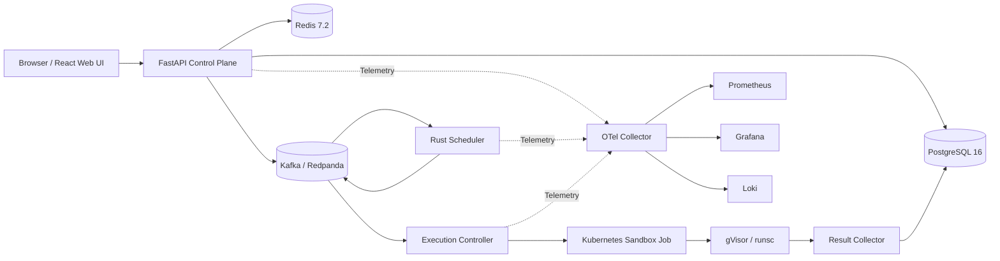

# ForgeRun — Distributed Code Execution & Judge Platform

> ForgeRun is a production-grade, event-driven distributed online judge and code execution engine engineered with Rust, Python, PostgreSQL, Kafka, and Kubernetes, enforcing strict multi-tenant fairness and gVisor kernel-isolated sandboxing for hostile workloads.

---

## 1. Architecture



## 2. Live Demo & Failure Recovery
- **Interactive Web App:** `http://localhost:3000` (Phase 1+)
- **Live Observability (Grafana):** `http://localhost:3001`
- **Failure Recovery In Action:** When runner nodes or execution pods terminate mid-run, ForgeRun reconciles state deterministically via Kubernetes Job watches and safely retries infrastructure failures without corrupting user submission attempts.

## 3. Key Engineering Decisions
- **Transactional Outbox:** Submission records and outbox events commit in a single PostgreSQL ACID transaction. Eliminates dual-write anomalies.
- **Durable Event Backbone:** Apache Kafka/Redpanda decouples ingestion from execution and guarantees at-least-once partitioned event streams.
- **Idempotency Everywhere:** Deduplication across HTTP (`client_request_id`), Kafka (`event_id` / `attempt_id`), and Kubernetes (`forge-attempt-<attempt_id>`).
- **Defense in Depth:** gVisor user-space kernel (`runsc`), Kubernetes Restricted Pod security profile, egress network blocking, and dropped capabilities.

## 4. Security Model
All submitted code is treated as active malware:
- Zero cloud or Kubernetes API credentials mounted in runner pods (`automountServiceAccountToken: false`).
- Deny-all network egress via Kubernetes `NetworkPolicy`.
- Non-root user execution with `allowPrivilegeEscalation: false` and dropped Linux capabilities.
- Ephemeral emptyDir storage with strict byte quotas and PID limits.
- Isolated runner node group with taints/tolerations to prevent noisy-neighbor impact on control-plane pods.

## 5. Scheduler Design
The custom Rust scheduler features:
- **Per-partition heap-backed priority queues** with dynamic aging to prevent starvation:
  $$\text{effective\_priority} = \text{base\_priority} + \min\left(\text{MAX\_AGING\_BONUS}, \left\lfloor \frac{\text{wait\_seconds}}{\text{AGING\_INTERVAL}} \right\rfloor \times \text{AGING\_STEP}\right)$$
- **Per-tenant concurrency limits** tracked via atomic Redis operations.
- **Deterministic tie-breaking** via monotonic sequence numbers.

## 6. Observability
- Distributed tracing via OpenTelemetry with baggage propagation across HTTP, Kafka, and Kubernetes Jobs.
- Metrics scraped into Prometheus and visualized via pre-configured Grafana dashboards.
- Structured JSON logging streamed to Grafana Loki.

## 7. Benchmark Results
*All benchmark results are gathered from executed tests; no simulated numbers.*
See [docs/benchmarks/README.md](docs/benchmarks/README.md) for methodology and benchmark run reports.

## 8. Local Setup & Quickstart

### Prerequisites
- Docker & Docker Compose v2+
- Python 3.10+
- Rust 1.75+ (Cargo)
- Node.js 20+

### Commands
```bash
# Bootstrap local environment and dependencies
make bootstrap

# Start local infrastructure (PostgreSQL, Redis, Redpanda, OTel, Prometheus, Grafana, Loki)
make dev

# Run unit and static analysis tests
make test

# Run integration tests against local infrastructure
make integration

# Teardown local environment
make down
```

## 9. Cloud Architecture & Infrastructure as Code
Production manifests are written in modular Terraform under `infra/terraform/`:
- Amazon EKS cluster with dedicated control and runner node groups.
- Amazon RDS PostgreSQL (Multi-AZ).
- Amazon ElastiCache for Redis.
- Amazon S3 bucket for test fixtures and raw execution artifacts.
- EKS Pod Identity for zero-credential pod security.

## 10. Architectural Decision Records (ADRs)
See [docs/adr/README.md](docs/adr/README.md) for the full index of decisions.

## 11. Testing Strategy
- **Unit Tests:** Fast, isolated tests for state transitions, scheduling algorithms, and adapters.
- **Integration Tests:** End-to-end containerized pipelines using ephemeral dependencies.
- **Security Tests:** Benign pathological programs (fork bombs, memory exhaustion, network egress probes) tested for expected enforcement.

## 12. Trade-offs and Limitations
- Ephemeral per-attempt Kubernetes Jobs introduce ~500ms pod initialization latency in exchange for guaranteed clean state and simple reconciliation.
- gVisor adds minor syscall overhead for I/O heavy benchmarks in exchange for strong host kernel isolation.
