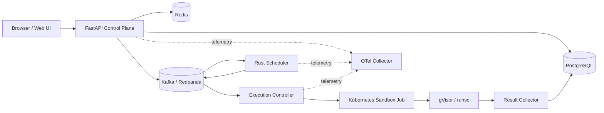

# ForgeRun Architecture Overview

## 1. System Vision & Architecture
ForgeRun is an asynchronous, event-driven online code judging and execution platform engineered for high reliability, strict isolation of untrusted code, and tenant fairness.

## 2. Core Components
- **API (FastAPI):** Ingests code submissions, checks idempotency keys, persists state transactionally into PostgreSQL along with outbox events, and streams execution progress via SSE.
- **Outbox Publisher:** Asynchronously tails `outbox_events` and publishes messages to Kafka topics with at-least-once delivery guarantees.
- **Scheduler (Rust):** Consumes `forge.submission.created.v1`, manages per-tenant queues, balances fairness via dynamic aging calculations, checks concurrency quotas in Redis, and dispatches `forge.execution.scheduled.v1`.
- **Execution Controller:** Consumes scheduled attempts and spawns short-lived Kubernetes Jobs with strict security postures and resource boundaries.
- **Sandbox Runner:** Executes inside the container, handles compilation, pipes test cases through standard streams, enforces strict timeouts/output limits, and writes execution artifacts.
- **Result Collector:** Watches Job lifecycles, collects verdicts/metrics, updates PostgreSQL idempotently, and notifies downstream consumers.

## 3. Storage & Event Topology
- **PostgreSQL 16:** Authoritative data store. Schema versioning managed via Alembic.
- **Redis 7.2:** Transient rate limiting, hot counters, and tenant concurrency tracking.
- **Apache Kafka / Redpanda:** Durable, partitioned append-only event backbone.
